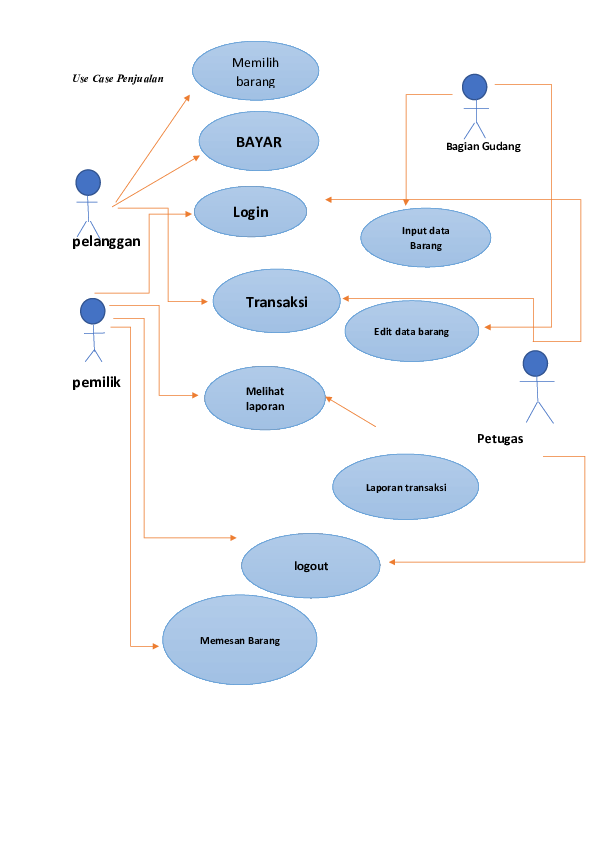

# Pemograman_web_2

# Website_Coffee_e-commerce

|  Anggota Kelompok  |
|----------------|
|Muhammad Riyadus Solihin (312210404)|
|Dhefi Nur Kholiq (312210414)|
|Muhammad Rizky Raka Pratama (312210397)||
|      |

## Gambaran Umum Sistem
1. Homepage: Halaman utama yang menampilkan informasi tentang toko pakaian "Chic Fashion", termasuk logo, gambaran singkat tentang gaya dan koleksi yang ditawarkan, serta highlight dari produk-produk utama yang tersedia.

2. Koleksi: Halaman ini menampilkan berbagai jenis pakaian, seperti atasan, bawahan, dress, jaket, dan aksesori, yang dijual oleh toko "Chic Fashion". Setiap produk dilengkapi dengan gambar yang jelas, deskripsi lengkap tentang bahan, warna, ukuran yang tersedia, serta harga yang terjangkau.

3. Pemesanan: Fitur yang memungkinkan pengguna untuk memilih produk yang diinginkan, menambahkannya ke keranjang belanja, dan melanjutkan ke proses pemesanan. Di sini, pengguna diminta untuk mengisi informasi pengiriman dan metode pembayaran yang diinginkan.

4. Keranjang Belanja: Halaman ini menampilkan daftar produk yang telah ditambahkan oleh pengguna ke dalam keranjang belanja. Pengguna dapat mengubah jumlah produk, menghapus produk yang tidak diinginkan, atau melanjutkan ke proses checkout untuk menyelesaikan pembelian.

5. Checkout: Langkah terakhir dalam proses pembelian di mana pengguna dapat memverifikasi pesanan, memilih metode pengiriman yang sesuai, dan melakukan pembayaran. Informasi pengiriman dan pembayaran akan diverifikasi sebelum pesanan diproses untuk pengiriman.

6. Akun Pengguna: Fitur yang memungkinkan pengguna untuk membuat akun pribadi, mengelola informasi pribadi seperti alamat pengiriman dan histori pembelian, serta mengatur preferensi akun seperti notifikasi tentang penawaran khusus dan diskon.

7. Promosi dan Diskon: Bagian dari situs web yang menampilkan promo, diskon, dan penawaran khusus dari "Chic Fashion". Pengguna dapat melihat promo yang sedang berlangsung dan menggunakan kode promo saat checkout untuk mendapatkan potongan harga atau keuntungan lainnya.

8. Ulasan Produk: Fitur yang memungkinkan pengguna untuk memberikan ulasan dan penilaian terhadap produk yang telah dibeli. Ulasan ini dapat membantu pengguna lain dalam membuat keputusan pembelian dan menambah kepercayaan pada kualitas produk yang ditawarkan.

9. Manajemen Stok: Bagian dari backend sistem yang memungkinkan pemilik toko untuk mengelola stok produk, menambahkan produk baru, mengatur kategori produk, dan mengupdate informasi tentang ketersediaan ukuran dan warna.

10. Pengelolaan Pesanan: Bagian dari backend sistem yang memungkinkan pemilik toko untuk melihat dan mengelola pesanan yang masuk, termasuk memproses pesanan, mengonfirmasi pembayaran, dan mengatur pengiriman.

11. Sistem Pembayaran: Integrasi dengan sistem pembayaran yang memungkinkan pengguna untuk melakukan pembayaran secara online menggunakan berbagai metode pembayaran yang tersedia, seperti kartu kredit, transfer bank, atau pembayaran elektronik.

12. Sistem Pemberitahuan: Fitur yang mengirimkan pemberitahuan kepada pengguna tentang status pesanan, konfirmasi pembayaran, pengiriman, dan informasi penting lainnya terkait transaksi yang dilakukan, seperti pengembalian atau pertanyaan tentang produk.

13. Sistem Keamanan: Langkah-langkah keamanan yang diimplementasikan untuk melindungi informasi pengguna, data transaksi, dan integritas sistem secara keseluruhan. Ini termasuk enkripsi data, perlindungan terhadap serangan cyber, dan manajemen akses yang aman untuk melindungi privasi dan keamanan informasi pengguna.
## Use Case
 
## Demo Produk
(https://www.figma.com/embed?embed_host=share&url=https%3A%2F%2Fwww.figma.com%2Fproto%2FPoytdIurVBpR007aHvAkwB%2FRiyad-Store%3Fnode-id%3D190-543%26t%3DWyTXGSTR1jMkdik6-1%26scaling%3Dscale-down%26page-id%3D161%253A32)